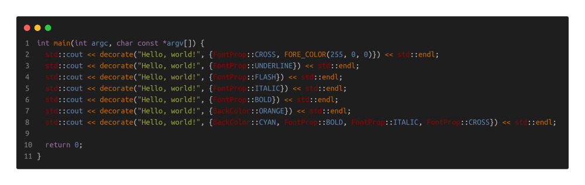
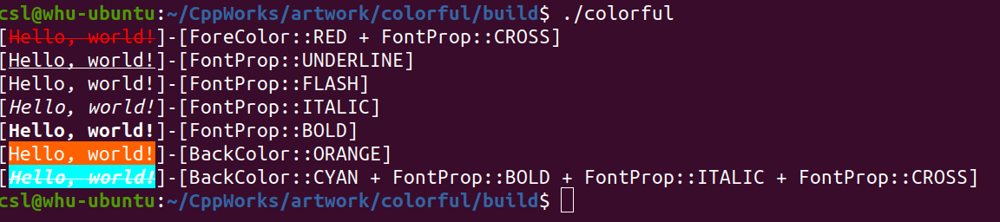

# Colorful Console

**Author: shlChen**

**E-Mail: 3079625093@qq.com**

[TOC]

## 1. Overview

Modify the output characters of the terminal control window under Linux system, including color, font format and so on.

## 2. Usage

code



output



## 3. Apis

```cpp
/**
 * @brief Convert an object to a string and decorate it
 *
 * @tparam Type the type of this object
 * @param obj the object
 * @param flags the ornaments
 * @return std::string the result string
 */
template <typename Type>
std::string decorate(const Type &obj, const std::string &flags);
```

```cpp
/**
 * @brief create the foreground color from [r, g, b]
 *
 * @param r the  red channel value
 * @param g the greent channel value
 * @param b the blue channel value
 */
static std::string create(ushort r, ushort g, ushort b);
```

```cpp
/**
 * @brief create the background color from [r, g, b]
 *
 * @param r the  red channel value
 * @param g the greent channel value
 * @param b the blue channel value
 */
static std::string create(ushort r, ushort g, ushort b);
```

```cpp
static const std::string RED = BACK_COLOR_DEFINE(255, 0, 0);
static const std::string GREEN = BACK_COLOR_DEFINE(0, 255, 0);
static const std::string BLUE = BACK_COLOR_DEFINE(0, 0, 255);
static const std::string BLACK = BACK_COLOR_DEFINE(0, 0, 0);
static const std::string WHITE = BACK_COLOR_DEFINE(255, 255, 255);
static const std::string GRAY = BACK_COLOR_DEFINE(192, 192, 192);
static const std::string YELLOW = BACK_COLOR_DEFINE(255, 255, 0);
static const std::string ORANGE = BACK_COLOR_DEFINE(255, 97, 0);
static const std::string PURPLE = BACK_COLOR_DEFINE(255, 0, 255);
static const std::string CYAN = BACK_COLOR_DEFINE(0, 255, 255);
```

