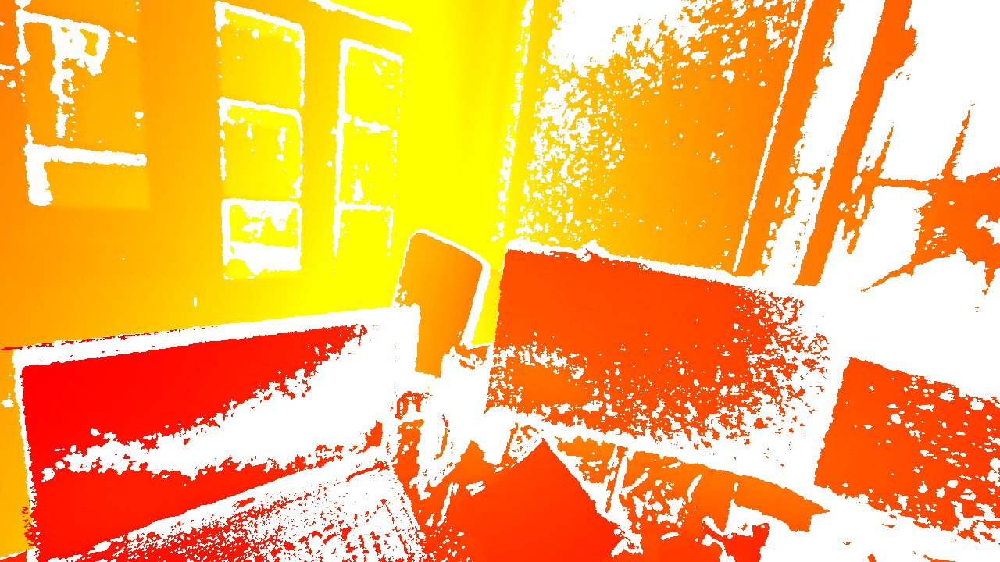

# Colorful Console

**Author: shlChen**

**E-Mail: 3079625093@qq.com**

[TOC]

## 1. Overview

Modify the output characters of the terminal control window under Linux system, including color, font format and so on.

## 2. Usage

### 2.1 Color-Terminal


```cpp
/**
 * @brief Convert an object to a string and decorate it
 *
 * @tparam Type the type of this object
 * @param obj the object
 * @param flags the ornaments
 * @return std::string the result string
 */
template <typename Type>
std::string decorate(const Type &obj, const std::string &flags);
```

```cpp
#define BACK_COLOR(r, g, b)
```

```cpp
#define FORE_COLOR(r, g, b)
```

```cpp
static constexpr const char *RED = BACK_COLOR(255, 0, 0);
static constexpr const char *GREEN = BACK_COLOR(0, 255, 0);
static constexpr const char *BLUE = BACK_COLOR(0, 0, 255);
static constexpr const char *BLACK = BACK_COLOR(0, 0, 0);
static constexpr const char *WHITE = BACK_COLOR(255, 255, 255);
static constexpr const char *GRAY = BACK_COLOR(192, 192, 192);
static constexpr const char *YELLOW = BACK_COLOR(255, 255, 0);
static constexpr const char *ORANGE = BACK_COLOR(255, 97, 0);
static constexpr const char *PURPLE = BACK_COLOR(255, 0, 255);
static constexpr const char *CYAN = BACK_COLOR(0, 255, 255);
```

```cpp
static constexpr const char *BOLD = FONT_PROP(1);
static constexpr const char *DARKEN = FONT_PROP(2);
static constexpr const char *ITALIC = FONT_PROP(3);
static constexpr const char *UNDERLINE = FONT_PROP(4);
static constexpr const char *TWINKLE = FONT_PROP(5);
static constexpr const char *FLASH = FONT_PROP(6);
static constexpr const char *REVERSE = FONT_PROP(7);
static constexpr const char *INVISABLE = FONT_PROP(8);
static constexpr const char *CROSS = FONT_PROP(9);
```

### 2.2 Color-Mapping




```cpp
// Continuous mapping
  static Crgb mapping(float value, float srcMin, float srcMax, const HSVMapping &map = style::panchromatic, bool reversal = false);
```

```cpp
// Discrete mapping
  static Crgb mapping(float value, float srcMin, float srcMax, ushort classes, const HSVMapping &map = style::panchromatic, bool reversal = false);
```

```cpp
// styles
const static HueMapping red_yellow{0.0, 60.0, 1.0, 1.0};
const static HueMapping yellow_green{45.0, 130.0, 1.0, 1.0};
const static HueMapping green_cyan{100.0, 190.0, 1.0, 1.0};
const static HueMapping cyan_blue{180.0, 240.0, 1.0, 1.0};
const static HueMapping blue_purple{220.0, 300.0, 1.0, 1.0};
const static HueMapping purple_red{290.0, 360.0, 1.0, 1.0};
const static HueMapping panchromatic{0.0, 360.0, 1.0, 1.0};

const static SatMapping red{0.0, 1.0, 360.0, 1.0};
const static SatMapping pink{0.0, 1.0, 340.0, 1.0};
const static SatMapping purple{0.0, 1.0, 310.0, 1.0};
const static SatMapping blue{0.0, 1.0, 240.0, 1.0};
const static SatMapping cyan{0.0, 1.0, 190.0, 1.0};
const static SatMapping green{0.0, 1.0, 120.0, 1.0};
const static SatMapping yellow{0.0, 1.0, 60.0, 1.0};
const static SatMapping orange{0.0, 1.0, 20.0, 1.0};

const static HueMapping red_yellow_green{0.0, 150.0, 1.0, 1.0};
const static HueMapping yellow_green_cyan{50.0, 180.0, 1.0, 1.0};
const static HueMapping green_cyan_blue{50.0, 250.0, 1.0, 1.0};
const static HueMapping cyan_blue_purple{180.0, 300.0, 1.0, 1.0};
const static HueMapping blue_purple_red{240.0, 360.0, 1.0, 1.0};
const static HueMapping cold{180.0, 360.0, 1.0, 1.0};
const static HueMapping worm{0.0, 180.0, 1.0, 1.0};

const static ValMapping gray{0.0, 1.0, 0.0, 0.0};
const static ValMapping black_red{0.0, 1.0, 0.0, 1.0};
const static ValMapping black_green{0.0, 1.0, 120.0, 1.0};
const static ValMapping black_blue{0.0, 1.0, 240.0, 1.0};
```

```cpp
// or define by yourself

// map value to hue dime
struct HueMapping : public HSVMapping {...}

// map value to sat dime
struct SatMapping : public HSVMapping {...}

// map value to val dime
struct ValMapping : public HSVMapping {...}
```

